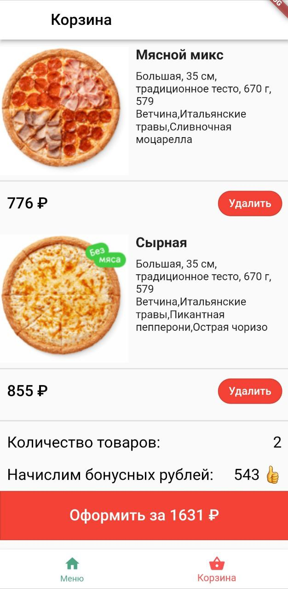

# Pizza_app
Домашний проект для освоения навыков работы с Flutter.

## Основной функционал :
 - Поиск продуктов 
 - Множественный выбор ингредиентов
 - Выбор размера продукта
 - Система начисления бонусов
  
### Основной экран
     
 
### Поиск желаемого продукта  

### Выбор ингредиентов
 
 
### Корзина
 
